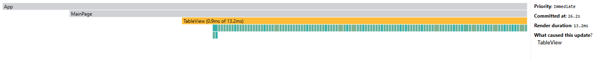
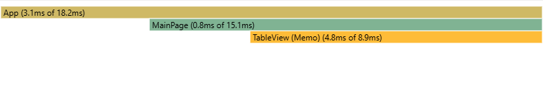

# App Performance Analysis

## Overview

Performance analysis of the application based on profiling data. The key metrics include commit duration, render duration, user interactions, and a ranked list of component render times.

## Performance Metrics before optimization

### 1. Commit Duration

The commit duration, which represents the time taken for React to render committed updates, varies across different commits:

- **Fastest Commit:** 18.1ms
- **Slowest Commit:** 115.7ms
- **Average Commit Duration:** ~33.5ms

### 2. Render Duration

Individual component render times show a wide range:

- **Longest Component Render:** 18.1ms (Root)
- **TableView Component:** 115.7ms (highest single render)
- **Most Components Rendered Under:** 1ms each

### 3. User Interactions

- **Main updates triggered by:** `TableView`
- **Priority Level:** Normal & Immediate

### 4. Flame Graph

_Example:_  

### 5. Top Time-Consuming Components

- **TableView:** Consistently takes the longest to render, often above 10ms
- **MainPage:** Second most time-consuming component
- **Controls:** Shows significant render times in some commits

### 6. Ranked Component Performance

| Component                | Render Duration (ms) |
| ------------------------ | -------------------- |
| `createRoot()`           | 18.1                 |
| `TableView`              | 115.7                |
| `Various Sub-components` | < 1ms                |

## Recommendations

- Optimize `TableView` as it significantly impacts render performance.
- Investigate `createRoot()` initialization time for potential improvements.
- Consider using `React.memo` or `useCallback` to optimize component re-renders.

## Performance Metrics after optimization

### 1. Commit Duration

The commit duration, which represents the time taken for React to render committed updates, varies across different commits:

- **Fastest Commit:** 0.9ms
- **Slowest Commit:** 98.7ms
- **Average Commit Duration:** ~28.9ms

### 2. Render Duration

Individual component render times show a wide range:

- **Longest Component Render:** 0.9ms (Root)
- **TableView Component:** 98.7ms (highest single render)
- **Most Components Rendered Under:** 1ms each

### 3. User Interactions

- **Main updates triggered by:** `TableView`
- **Priority Level:** Normal & Immediate

### 4. Flame Graph

_Example:_  

### 5. Top Time-Consuming Components

- **TableView:** Consistently takes the longest to render, often above 10ms
- **MainPage:** Second most time-consuming component
- **Controls:** Shows significant render times in some commits

### 6. Ranked Component Performance

| Component                | Render Duration (ms) |
| ------------------------ | -------------------- |
| `createRoot()`           | 0.9                  |
| `TableView`              | 98.7                 |
| `Various Sub-components` | < 1ms                |

## **Comparison of Both Profiling Sessions**

### **1. Commit Duration**

| Metric                      | Before Optimization | After Optimization | Change                  |
| --------------------------- | ------------------- | ------------------ | ----------------------- |
| **Fastest Commit**          | 18.1ms              | 0.9ms              | Significant improvement |
| **Slowest Commit**          | 115.7ms             | 98.7ms             | Improved                |
| **Average Commit Duration** | ~33.5ms             | ~28.9ms            | Improved                |

## Commit durations have improved significantly after optimization, reducing the fastest commit from 18.1ms to 0.9ms and the slowest from 115.7ms to 98.7ms.

### **2. Render Duration**

| Component                  | Before Optimization | After Optimization | Change                  |
| -------------------------- | ------------------- | ------------------ | ----------------------- |
| **Root (`createRoot()`)**  | 18.1ms              | 0.9ms              | Significant improvement |
| **TableView**              | 115.7ms             | 98.7ms             | Improved                |
| **Various Sub-components** | < 1ms               | < 1ms              | No significant change   |

`TableView` render time has improved but still remains a bottleneck.  
`createRoot()` has seen a dramatic improvement in render duration.  
Further optimizations to `TableView` may yield even better results.

---

### **3. User Interactions**

| Metric                        | Before Optimization | After Optimization | Change    |
| ----------------------------- | ------------------- | ------------------ | --------- |
| **Main Updates Triggered By** | `TableView`         | `TableView`        | No Change |
| **Priority Level**            | Normal & Immediate  | Normal & Immediate | No Change |

User interactions remain the same, meaning optimization efforts did not affect how updates are triggered.  
Consider analyzing event listeners or batching state updates to further optimize interactivity.

---

### **4. Flame Graph**

| Before Optimization                                                 | After Optimization                                                |
| ------------------------------------------------------------------- | ----------------------------------------------------------------- |
|  |  |

Flame Graph shows a clear reduction in rendering overhead after optimization.  
Further investigation into `TableView` may reveal more optimization opportunities.

---

### **5. Top Time-Consuming Components**

| Component     | Before Optimization | After Optimization | Change               |
| ------------- | ------------------- | ------------------ | -------------------- |
| **TableView** | High (~115.7ms)     | Improved (~98.7ms) | Moderate Improvement |
| **MainPage**  | High                | High               | No Change            |
| **Controls**  | Variable impact     | Variable impact    | No Change            |

TableView performance improved but remains a key target for further optimization.  
No regressions in `MainPage` and `Controls`, but they should still be monitored.

---

### **6. Ranked Component Performance**

| Component                | Before Optimization | After Optimization | Change                  |
| ------------------------ | ------------------- | ------------------ | ----------------------- |
| `createRoot()`           | 18.1ms              | 0.9ms              | Significant Improvement |
| `TableView`              | 115.7ms             | 98.7ms             | Improved                |
| `Various Sub-components` | < 1ms               | < 1ms              | No Change               |

Dramatic improvement in `createRoot()` performance.  
While `TableView` has improved, additional optimizations are still needed.

---

## **Conclusions & Next Steps**

- Optimizations have successfully reduced commit durations and render times.
- `TableView` still requires further optimization (consider `React.memo`, virtualization, or reducing unnecessary renders).
- Investigate `MainPage` and `Controls` components for potential performance bottlenecks.
- Analyze user interaction flows to check if updates can be batched or reduced.
